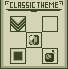

# SnakeImproved

SnakeImproved is a basic snake game, or is it ?

## Installation

Use the package manager [pip](https://pip.pypa.io/en/stable/) to install pygame.

```bash
pip install pygame
```

## Themes

For the first theme we have a classic snake theme with a 3'bit palette 



## Contributing
Pull requests are welcome. For major changes, please open an issue first to discuss what you would like to change.

Please make sure to update tests as appropriate.